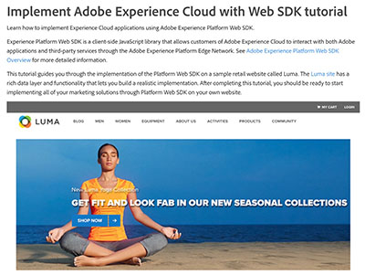

# Tutoriales de Audience Manager

Bienvenido al sitio de tutoriales de Audience Manager. El uso de estos tutoriales junto con el [documentación](https://experienceleague.adobe.com/docs/audience-manager/user-guide/aam-home.html) le permitirá comprender mejor cómo utilizar Adobe Audience Manager para crear y activar audiencias en cualquier canal o dispositivo que utilice los mejores de su clase para Adobe [!DNL data management platform].

* **Selección de personal** resalta algunos de nuestros contenidos favoritos
* Explore el contenido por tema y subtema en el **menú de navegación de la izquierda**
* Utilice el campo de **búsqueda** en la parte superior de la página si sabe qué está buscando

## Novedades

* **[Información general de [!UICONTROL Profile Merge Rules] (Vídeo)](build-and-manage-audiences/profile-merge/overview-of-profile-merge-rules.md)**

   *Comprender lo que [!UICONTROL Profile Merge Rules] son, cómo funcionan y su valor para el experto en marketing.*

* **[[!UICONTROL Profile Merge Rule]Ejemplos y casos de uso](build-and-manage-audiences/profile-merge/profile-merge-rule-examples-and-use-cases.md)**

   *En este vídeo verá ejemplos de [!UICONTROL Profile Merge Rules] y lo que significan, así como los casos de uso que [!UICONTROL Profile Merge Rules] resolver para.*

* **[Crear y configurar destinos basados en personas](data-activation/people-based-destinations/create-and-configure-people-based-destinations.md)**

   *Obtenga información sobre cómo configurar un [!DNL People-Based Destination] en la IU de Audience Manager*

## Selección de personal

<table>
<tr>
  <td>
    
    

      <a href="https://experienceleague.adobe.com/docs/platform-learn/implement-web-sdk/overview.html?lang=es">
    <strong>Tutorial de implementación de Adobe Experience Cloud con SDK web</strong>
    </a>
    

    

    <em>Obtenga información sobre cómo implementar aplicaciones de Experience Cloud mediante el SDK web de Adobe Experience Platform.</em>
    

  </td>
  <td>
    
    

      <a href="https://experienceleague.adobe.com/docs/audience-manager-learn/tutorials/other-integrations/integrating-with-rtcdp/rtcdp-segments-for-aam-users.html">
    <strong>Explicación de los segmentos de CDP en tiempo real para usuarios de Audience Manager</strong>
    </a>
    

    

    <em>Este vídeo analiza las diferencias en la creación de segmentos y segmentos entre CDP en tiempo real y Audience Manager.</em>
    

  </td>
  <td>
    
    

      <a href="https://experienceleague.adobe.com/docs/audience-manager-learn/tutorials/build-and-manage-audiences/algorithmic-models/configure-and-report-on-predictive-audiences.html">
    <strong>Configuración e informes de Predictive Audiences en Audience Manager</strong>
    </a>
    

    

    <em>En este vídeo, se mostrará la configuración de Audiencias predictivas en la interfaz del Audience Manager.</em>
    

  </td>
</tr>
</table>

