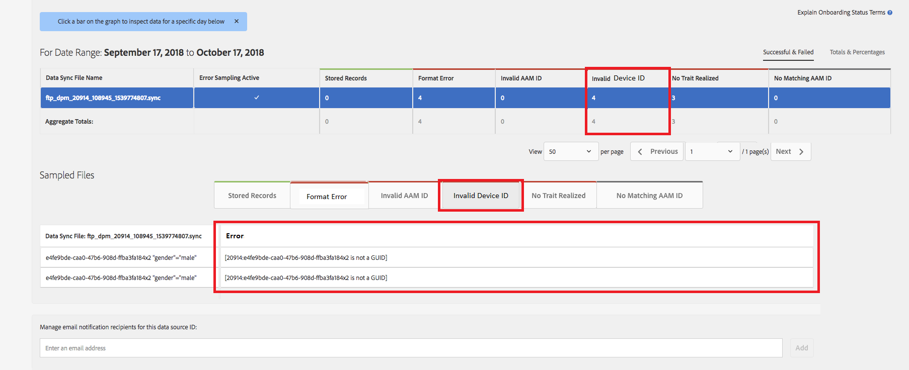

# Validación global de ID de dispositivo {#global-device-id-validation}

Los identificadores de publicidad de dispositivo (es decir, iDFA, GAID, Roku ID) tienen estándares de formato que deben cumplirse para poder utilizarse en el ecosistema de publicidad digital. En la actualidad, los clientes y socios pueden cargar ID en fuentes de datos globales en cualquier formato sin que se les notifique si el ID tiene el formato adecuado. Esta función introducirá la validación de los ID de dispositivo enviados a las fuentes de datos globales para obtener un formato adecuado y proporcionará mensajes de error cuando los ID tengan un formato incorrecto. Admitiremos la validación para [!DNL iDFA], [!DNL Google Advertising] y [!DNL Roku IDs] en el lanzamiento.

## Descripción general de las normas de formato {#overview-of-format-standards}

Los siguientes son los grupos de ID de publicidad de dispositivos globales que están reconocidos y admitidos actualmente por AAM. Se implementan como compartidos [!UICONTROL Data Sources] que puede utilizar cualquier cliente o socio de datos que trabaje con datos vinculados a los usuarios de estas plataformas.

<table>
  <tr>
   <td>Plataforma </td>
   <td>ID de fuente de datos AAM </td>
   <td>Formato de ID </td>
   <td>AAM PID </td>
   <td>Notas </td>
  </tr>
  <tr>
   <td>Google Android (GAID)</td>
   <td>20914</td>
   <td>32 números hexadecimales, presentados generalmente como 8-4-4-4-12<em>ejemplo, 97987bca-ae59-4c7d-94ba-ee4f19ab8c21  </em> </td>
   <td>1352</td>
   <td>Esta ID debe recopilarse en un formulario sin procesar/sin hash/sin modificar Referencia: <a href="https://play.google.com/about/monetization-ads/ads/ad-id/">https://play.google.com/about/monetization-ads/ads/ad-id/</a></td>
  </tr>
  <tr>
   <td>Apple iOS (IDFA)</td>
   <td>20915</td>
   <td>32 números hexadecimales, presentados generalmente como 8-4-4-4-12 <em>Por ejemplo, 6D92078A-8246-4BA4-AE5B-76104861E7DC  </em> </td>
   <td>3560</td>
   <td>Esta ID debe recopilarse en un formulario sin procesar/sin hash/sin modificar Referencia: <a href="https://support.apple.com/en-us/HT205223">https://support.apple.com/en-us/HT205223</a></td>
  </tr>
  <tr>
   <td>Roku (RIDA)</td>
   <td>121963</td>
   <td>32 números hexadecimales, presentados generalmente como 8-4-4-4-12 <em>ejemplo,</em> <em>fcb2a29c-315a-5e6b-bcfd-d889ba19aada</em></td>
   <td>11536</td>
   <td>Esta ID debe recopilarse en un formulario sin procesar/sin hash/sin modificar Referencia: <a href="https://sdkdocs.roku.com/display/sdkdoc/Roku+Advertising+Framework">https://sdkdocs.roku.com/display/sdkdoc/Roku+Advertising+Framework</a> </td>
  </tr>
  <tr>
   <td>Microsoft Advertising ID (MAID)</td>
   <td>389146</td>
   <td>Cadena numérica alfa</td>
   <td>14593</td>
   <td>Esta ID debe recopilarse en un formulario sin procesar/sin hash/sin modificar Referencia: <a href="https://docs.microsoft.com/en-us/uwp/api/windows.system.userprofile.advertisingmanager.advertisingid">https://docs.microsoft.com/en-us/uwp/api/windows.system.userprofile.advertisingmanager.advertisingid</a> <a href="https://msdn.microsoft.com/en-us/library/windows/apps/windows.system.userprofile.advertisingmanager.advertisingid.aspx">https://msdn.microsoft.com/en-us/library/windows/apps/windows.system.userprofile.advertisingmanager.advertisingid.aspx</a></td>
  </tr>
  <tr>
   <td>Samsung DUID</td>
   <td>404660</td>
   <td>Ejemplo de cadena numérica alfa, 7XCBNROQJQPYW</td>
   <td>15950</td>
   <td>Esta ID debe recopilarse en un formulario sin procesar/sin hash/sin modificar Referencia: <a href="https://developer.samsung.com/tv/develop/api-references/samsung-product-api-references/productinfo-api">https://developer.samsung.com/tv/develop/api-references/samsung-product-api-references/productinfo-api</a> </td>
  </tr>
</table>

## Configuración de un identificador de publicidad en la aplicación {#setting-an-advertising-identifier-in-the-app}

Configurar el ID del anunciante en la aplicación es realmente un proceso de dos pasos: primero recuperar el ID del anunciante y, después, enviarlo al Experience Cloud. A continuación encontrará vínculos para realizar estos pasos.

1. Recuperar el ID
   1. [!DNL Apple] información sobre [!DNL advertising ID] se puede encontrar [AQUÍ](https://developer.apple.com/documentation/adsupport/asidentifiermanager).
   1. Alguna información sobre cómo configurar la variable [!DNL advertiser ID] para [!DNL Android] se pueden encontrar desarrolladores [AQUÍ](http://android.cn-mirrors.com/google/play-services/id.html).
1. Envíelo al Experience Cloud mediante el [!DNL setAdvertisingIdentifier] en el SDK
   1. Información sobre el uso `setAdvertisingIdentifier` está en la [documentación](https://aep-sdks.gitbook.io/docs/using-mobile-extensions/mobile-core/identity/identity-api-reference#set-an-advertising-identifier) para ambos [!DNL iOS] y [!DNL Android].

`// iOS (Swift) example for using setAdvertisingIdentifier:`
`ACPCore.setAdvertisingIdentifier([AdvertisingId]) // ...where [AdvertisingId] is replaced by the actual advertising ID`

## Mensajes de error de DCS para ID incorrectos  {#dcs-error-messaging-for-incorrect-ids}

Cuando se envía un ID de dispositivo global incorrecto (IDFA, GAID, etc.) en tiempo real al Audience Manager, se devuelve un código de error en la visita. A continuación se muestra un ejemplo de error devuelto porque el ID se envía como un [!DNL Apple IDFA], que solo debe contener letras mayúsculas y, sin embargo, hay una x minúscula en el ID.

Consulte la [documentación](https://experienceleague.adobe.com/docs/audience-manager/user-guide/api-and-sdk-code/dcs/dcs-api-reference/dcs-error-codes.html?lang=en#api-and-sdk-code) para la lista de códigos de error.

## Integración de ID de dispositivo globales {#onboarding-global-device-ids}

Además del envío en tiempo real de ID de dispositivos globales, también puede &quot;[!DNL onboard]&quot; (cargar) datos también con los ID. Este proceso es el mismo que cuando se incorporan datos a los ID de cliente (normalmente mediante pares clave/valor), pero simplemente se usan los ID de fuente de datos adecuados, de modo que los datos se asignen al ID de dispositivo global. La documentación sobre el proceso de incorporación se encuentra en la [documentación](https://experienceleague.adobe.com/docs/audience-manager/user-guide/implementation-integration-guides/sending-audience-data/batch-data-transfer-process/batch-data-transfer-overview.html?lang=en#implementation-integration-guides). Recuerde utilizar el ID de fuente de datos global, según la plataforma que utilice.

Si se envían ID de dispositivo globales incorrectos mediante el proceso de incorporación, los errores se mostrarán en la variable [[!DNL Onboarding Status Report]](https://experienceleague.adobe.com/docs/audience-manager/user-guide/reporting/onboarding-status-report.html?lang=en#reporting).

A continuación, se muestra un ejemplo de error que se produciría en ese informe:

