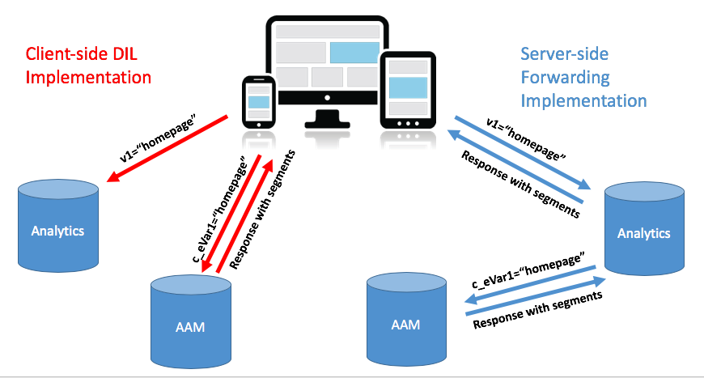
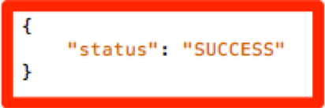

# Migración de la implementación de AAM del sitio del DIL [!DNL Client-Side] a [!DNL Server-Side Forwarding] {#migrating-your-site-s-aam-implementation-from-client-side-dil-to-server-side-forwarding}

Este tutorial se aplica si tiene Adobe Audience Manager (AAM) y Adobe Analytics, y actualmente está enviando una visita desde la página a AAM mediante el código &quot;DIL&quot; ([!DNL Data Integration Library]) y también enviando una visita desde la página a Adobe Analytics. Dado que tiene ambas soluciones y que ambas forman parte de Adobe Experience Cloud, tiene la oportunidad de seguir la práctica recomendada de activar &quot;[!DNL Server-Side Forwarding] (SSF)&quot;, que permite a los [!DNL Analytics] servidores de recopilación de datos reenviar los datos de análisis del sitio en tiempo real al Audience Manager, en lugar de hacer que el código [!DNL client-side] envíe una visita adicional desde la página a AAM. Este tutorial le guiará por los pasos para hacer el cambio de la implementación anterior &quot;[!DNL Client-Side DIL]&quot; al método más reciente &quot;[!DNL Server-Side forwarding]&quot;.

## [!DNL Client-Side] (DIL) vs.  [!DNL Server-Side] {#client-side-dil-vs-server-side}

Al comparar y contrastar estos dos métodos de obtención de datos de Adobe Analytics en AAM, podría resultar útil visualizar primero las diferencias en la siguiente imagen:

### [!DNL Client-side] Implementación del DIL {#client-side-dil-implementation}

Si utiliza este método para obtener datos de Adobe Analytics en AAM, significa que tiene dos visitas provenientes de sus páginas web: Una que va a [!DNL Analytics] y otra que va a AAM (después de haber copiado los datos de [!DNL Analytics] en la página Web. [!UICONTROL Segments] se devuelven de AAM a la página, donde se pueden utilizar para la personalización, etc. Se considera una implementación &quot;heredada&quot; y ya no se recomienda.

Más allá del hecho de que esto no sigue las prácticas recomendadas, las desventajas de utilizar este método incluyen:

* Dos visitas provenientes de la página en lugar de solo una
* [!UICONTROL Server-Side Forwarding] es necesario para el uso compartido en tiempo real de AAM audiencias a  [!DNL Analytics], por lo que las  [!DNL Client-side] implementaciones no permiten esta función (y potencialmente otras funciones en el futuro)

Se recomienda pasar a un método [!UICONTROL Server-Side Forwarding] de implementación de AAM.

### [!UICONTROL Server-Side Forwarding] Implementación {#server-side-forwarding-implementation}

Como se muestra en la imagen anterior, una visita viene de la página web a Adobe Analytics. [!DNL Analytics] a continuación, envía esos datos a AAM en tiempo real y los visitantes se evalúan en AAM  [!UICONTROL traits] y  [!UICONTROL segments], como si la visita hubiera llegado directamente desde la página.

[!UICONTROL Segments] se devuelven en la misma visita en tiempo real a  [!DNL Analytics], que reenvía la respuesta a la página web para su personalización, etc.

No hay un inconveniente en el tiempo para pasar al reenvío del lado del servidor. Recomendamos encarecidamente que cualquier persona que tenga Audience Manager y [!DNL Analytics] utilice este método de implementación.

## Tiene Dos Tareas Principales {#you-have-two-main-tasks}

Hay bastante información en esta página, y todo es importante, por supuesto. Sin embargo, **todo se reduce a dos cosas principales que necesita hacer**:

1. Cambie el código de [!DNL Client-Side] código de DIL a [!UICONTROL Server-Side Forwarding]
1. Girar el conmutador en [!DNL Analytics] [!DNL Admin Console] para iniciar el reenvío real de datos (por [!UICONTROL report suite])

Si omite cualquiera de estos dos, el reenvío del lado del servidor no funcionará correctamente. Se han añadido pasos y datos adicionales a este documento para ayudarle a realizar correctamente estos dos pasos en la configuración.

## Opciones de implementación {#implementation-options}

Al pasar de [!DNL client-side] a [!DNL server-side], una de las tareas que tendrá es cambiar el código por el nuevo código [!UICONTROL Server-Side Forwarding]. Esto se realiza mediante una de las siguientes opciones:

* Adobe Experience Platform Launch: nuestra opción de implementación recomendada para propiedades web. Verá que esta es una tarea muy fácil, ya que [!DNL Launch] ha hecho todo lo duro por usted.
* En la página : también puede colocar el nuevo código SSF directamente en la función `doPlugins` dentro del archivo [!DNL appMeasurement.js] si (todavía) no utiliza Launch de Adobe
* Otros administradores de etiquetas : Se pueden tratar como la opción anterior (En la página), ya que seguiría colocando el código SSF en `doPlugins`, dondequiera que el otro administrador de etiquetas almacene el código [!DNL AppMeasurement]

Veremos cada una de estas opciones en la sección Actualización del código .

## Pasos de la implementación {#implementation-steps}

### Paso 0: Requisito previo: Servicio de ID de Experience Cloud (ECID) {#step-prerequisite-experience-cloud-id-service-ecid}

El requisito previo principal para pasar a [!UICONTROL Server-Side Forwarding] es tener implementado el servicio de ID de Experience Cloud. Esto se hace más fácilmente si utiliza Experience Platform Launch, en cuyo caso simplemente instala la extensión ECID y hará el resto.

Si está utilizando un sistema de administración de etiquetas que no es de Adobe, o ningún sistema de administración de etiquetas, implemente ECID para ejecutar **antes** cualquier otra solución de Adobe. Consulte la [documentación de ECID](https://experienceleague.adobe.com/docs/id-service/using/home.html) para obtener más información. El único otro requisito previo es el de las versiones de código, por lo que, como simplemente aplica las versiones más recientes del código en los pasos siguientes, estará bien.

>[!NOTE]
>
>Lea todo el documento antes de implementarlo. La sección &quot;Temporización&quot; a continuación tiene información importante sobre *cuándo* debe implementar cada pieza, incluido el ECID (si aún no se ha implementado).

### Paso 1: Registrar las opciones usadas actualmente desde el código del DIL {#step-record-currently-used-options-from-dil-code}

A medida que se prepara para pasar del código de DIL [!DNL Client-Side] a [!UICONTROL Server-Side Forwarding], el primer paso es identificar todo lo que está haciendo con el código de DIL, incluida la configuración personalizada y los datos enviados a AAM. Algunas cosas que hay que tener en cuenta y considerar son:

* Variables [!DNL Analytics] normales, utilizando el módulo de DIL [!DNL siteCatalyst.init]: no tendrá que preocuparse por esta, ya que su trabajo es simplemente enviar las variables [!DNL Analytics] normales y eso sucederá simplemente teniendo SSF habilitado.
* Subdominio de socio : en la función DIL.create, tome nota del parámetro `partner`. Esto se conoce como su &quot;subdominio de socio&quot; o, en ocasiones, &quot;ID de socio&quot; y será necesario cuando coloque el nuevo código SSF.
* [!DNL Visitor Service Namespace] - También conocido como &quot;[!DNL Org ID]&quot; o &quot;[!DNL IMS Org ID]&quot;, lo necesitará también al configurar el nuevo código SSF. Anote esto.
* containerNSID, uuidCookie y otras opciones avanzadas : tome nota de cualquier opción avanzada adicional que esté usando para que también pueda configurarla en el código SSF.
* Variables de página adicionales : si se envían otras variables a AAM desde la página (además de las variables [!DNL Analytics] normales que gestiona siteCatalyst.init), tendrá que tomarlas en cuenta para que se puedan enviar a través de SSF (alerta de spoiler: mediante [!DNL contextData] variables).

### Paso 2: Actualización del código {#step-updating-the-code}

En la sección anterior titulada &quot;Opciones de implementación&quot;, se ofrecen varias opciones sobre cómo y dónde está implementando [!UICONTROL Server-Side Forwarding]. Para que esta sección sea efectiva, necesitamos dividirla en estas secciones (con dos de ellas combinadas). Vaya al método de esta sección que describa mejor sus necesidades.

#### Adobe Experience Platform Launch {#launch-by-adobe}

Vea el siguiente vídeo para obtener más información sobre cómo mover las opciones de implementación del código de DIL [!DNL Client-Side] a [!UICONTROL Server-Side Forwarding] en Experience Platform Launch.

>[!VIDEO](https://video.tv.adobe.com/v/26310/?quality=12)

#### &quot;En la página&quot; o que no sean de Adobe Tag Manager {#on-the-page-or-non-adobe-tag-manager}

Vea el siguiente vídeo para obtener más información sobre cómo mover las opciones de implementación del código de DIL [!DNL Client-Side] a [!UICONTROL Server-Side Forwarding] en código [!DNL AppMeasurement], ya sea en un archivo o en un sistema de administración de etiquetas que no sea de Adobe.

>[!VIDEO](https://video.tv.adobe.com/v/26312/?quality=12)

### Paso 3: Activación del reenvío (por [!UICONTROL Report Suite]) {#step-enabling-the-forwarding-per-report-suite}

Hasta ahora, en este tutorial hemos pasado todo el tiempo en cambiar el código de [!DNL Client-Side DIL] a [!UICONTROL Server-Side Forwarding]. Está bien, porque es la parte más difícil. Esta sección, aunque verá que es superfácil, es tan importante como actualizar el código. En este vídeo, verá cómo voltear el conmutador que habilita el reenvío real de datos de Analytics al Audience Manager.

>[!VIDEO](https://video.tv.adobe.com/v/26355/?quality-12)

**NOTA:** Como se indica en el vídeo, recuerde que la habilitación del reenvío tardará hasta 4 horas en implementarse completamente en el backend del Experience Cloud.

## Temporización {#timing}

Como recordatorio, existen dos tareas principales para pasar de [!DNL Client-Side DIL] a [!UICONTROL Server-Side Forwarding]:

1. Actualización del código
1. Volteando el conmutador en el [!DNL Analytics] [!DNL Admin Console]

Pero la pregunta es, ¿cuál haces primero? ¿Importa? Bien, perdón, fueron dos preguntas. Pero las respuestas son... depende, y sí, *puede* importar. ¿Cómo es eso para vago? Desglosémoslo. Pero primero una pregunta adicional que puede surgir si es una organización grande con muchos sitios: ¿Tengo que hacer todo a la vez? Ese es un poco más fácil. No. Puedes hacerlo pieza a pieza...como que. :)

### Un poco más profundo {#a-little-deeper-dive}

La razón por la que el tiempo y el orden importan es debido a cómo funciona el reenvío *realmente *que puede resumirse en los siguientes pocos hechos técnicos:

* Si tiene implementado el Servicio de ID de Experience Cloud (ECID) y el conmutador [!DNL Analytics] [!DNL Admin Console] (&quot;el conmutador&quot;) está activado, los datos se reenviarán de [!DNL Analytics] a AAM, incluso aunque aún no haya actualizado el código.
* Si no tiene implementado ECID, los datos no se reenviarán, aunque tenga el conmutador activado, y el código SSF.
* El código SSF (ya sea en [!DNL Launch] o en la página) realmente gestiona la respuesta y, por supuesto, es necesario para completar la migración.
* Recuerde que el conmutador SSF está habilitado por [!UICONTROL Report Suite], pero que el código lo gestiona la propiedad en [!DNL Launch] o el archivo [!DNL AppMeasurement] si no utiliza [!DNL Launch]

### Prácticas recomendadas {#best-practices}

Basándose en estos detalles técnicos, estas son las recomendaciones para el momento de &quot;qué hacer cuando&quot;:

#### Si NO tiene ECID aún implementado {#if-you-do-not-have-ecid-yet-implemented}

1. Girar el conmutador en [!DNL Analytics] para cada [!UICONTROL report suite] que habilitará para SSF

   1. El reenvío aún no comenzará porque no tiene ECID

1. Por sitio, actualice el código de [!DNL Client-Side DIL] a SSF (esto podría estar en [!DNL Launch] o en la página, como se explica en otra sección anterior)

   1. El reenvío fluirá ahora (como ha añadido ECID) y también debe recibir una respuesta JSON adecuada a su señalización [!DNL Analytics] (consulte la sección Validación y solución de problemas para obtener más información)

#### Si tiene implementado ECID {#if-you-do-have-ecid-implemented}

1. Prepare y planifique para que esté preparado para actualizar su código de DIL a SSF por [!UICONTROL report suite] que habilitará para SSF:

   1. Girar el interruptor en [!DNL Analytics] para habilitar el SSF

      1. El reenvío empezará porque tiene ECID habilitado
   1. Tan pronto como sea posible, actualice el código de [!DNL Client-Side DIL] a SSF (esto podría estar en [!DNL Launch] o en la página, como se explica en otra sección anterior)

      1. Debe recibir una respuesta JSON adecuada a su señalización [!DNL Analytics] (consulte la sección Validación y solución de problemas más abajo para obtener más información)

**NOTA 1:** Es importante realizar estos dos pasos lo más cerca posible entre sí, ya que entre los pasos 1 y 2 anteriores, tendrá duplicación de datos en AAM. En otras palabras, el reenvío del lado del servidor habrá empezado a enviar datos de [!DNL Analytics] a AAM, y dado que el código del DIL sigue en la página, también habrá una visita que pasará directamente de la página a AAM, duplicando así los datos. Tan pronto como actualice el código de DIL a SSF, esto se aliviará.

**NOTA 2:** Si prefiere tener una pequeña discrepancia en los datos en lugar de una pequeña duplicación de datos, puede cambiar el orden de los pasos 1 y 2 anteriores. Si se mueve el código de DIL a SSF, se detendrá el flujo de datos en AAM hasta que se pueda girar el conmutador para activar el SSF para el [!UICONTROL report suite]. Normalmente, los clientes prefieren duplicar los datos en lugar de dejar de obtener visitantes en [!UICONTROL traits] y [!UICONTROL segments].

#### Temporización de migración cuando tiene muchos sitios y [!UICONTROL Report Suites] {#migration-timing-when-you-have-many-sites-and-report-suites}

Este tema se ha abordado brevemente en secciones anteriores, ya que la estrategia principal puede resumirse de la siguiente manera:

Migrar un sitio/[!UICONTROL report suite] (o grupo de sitios/[!UICONTROL report suites]) a la vez.

Sin embargo, esto puede resultar un poco complicado en función de algunos escenarios posibles:

* Tiene un sitio que contiene varios [!UICONTROL report suites] distintos
* Tiene un [!UICONTROL report suite] que incluye varios sitios (como un [!UICONTROL report suite] global)
* Utilice una propiedad [!DNL Launch] para cubrir varios sitios
* Tiene diferentes equipos de desarrollo para diferentes sitios

Debido a estos elementos, puede resultar un poco complicado. Las mejores cosas que puedo sugerir son:

* Tómese algún tiempo para elaborar una estrategia para migrar al SSF, basada en las cosas que se han explicado anteriormente
* En función del hecho de que una sola propiedad en [!DNL Launch] (o un solo archivo [!DNL AppMeasurement]) se asigne normalmente a 1 o 2 [!UICONTROL report suites] diferentes, es probable que pueda hacer un plan que funcione en estos grupos diferentes uno por uno, actualizando su empresa a SSF
* Si está trabajando con la asesoría de Adobe, hable con ellos acerca de su plan de migración para que puedan ayudarle según sea necesario

## Validación y solución de problemas {#validation-and-troubleshooting}

La forma principal de validar que [!UICONTROL Server-Side Forwarding] está funcionando es consultar la respuesta a cualquiera de sus visitas de Adobe Analytics procedentes de la aplicación.

Si no está haciendo [!UICONTROL server-side forwarding] de datos de [!DNL Analytics] al Audience Manager, no hay respuesta a la señalización [!DNL Analytics] (aparte de un píxel 2x2). Sin embargo, si lo utiliza, puede comprobar ciertos elementos en la solicitud y respuesta [!DNL Analytics] que le permiten saber que [!DNL Analytics] se está comunicando correctamente con el Audience Manager, reenviando la visita y obteniendo una respuesta.

>[!VIDEO](https://video.tv.adobe.com/v/26359/?quality=12)

**ADVERTENCIA:** Tenga cuidado con el falso &quot;éxito&quot;: si hay una respuesta y todo parece estar funcionando, asegúrese de que tiene el objeto &quot;material&quot; en la respuesta. Si no lo hace, es posible que vea un mensaje que dice [!DNL "status":"SUCCESS"]. Aunque parezca absurdo, esto es prueba de que NO funciona correctamente. Si lo ve, significa que ha completado la actualización de código en [!DNL Launch] o [!DNL AppMeasurement], pero que el reenvío en [!DNL Analytics] [!DNL Admin Console] aún no ha finalizado. En este caso, debe verificar que ha habilitado el reenvío del lado del servidor en [!DNL Analytics] [!DNL Admin Console] para su [!UICONTROL report suite]. Si lo ha hecho, y aún no han pasado 4 horas, tenga paciencia, ya que puede tardar tanto en realizar todos los cambios necesarios en el servidor.

Para obtener más información sobre [!UICONTROL Server-Side Forwarding], consulte la [documentación](https://experienceleague.adobe.com/docs/analytics/admin/admin-tools/server-side-forwarding/ssf.html).
