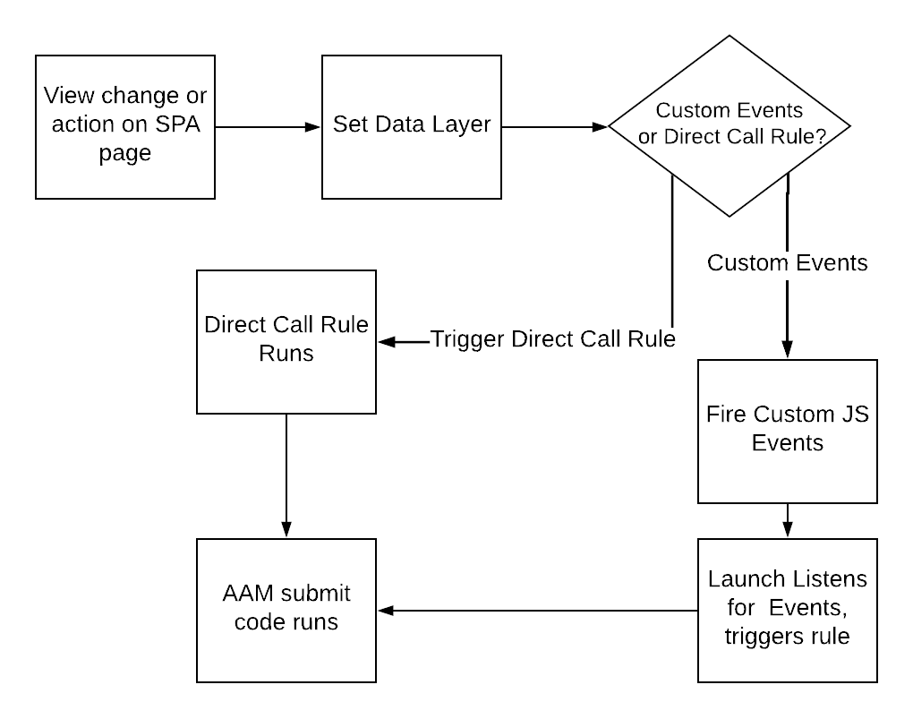

# Prácticas recomendadas en páginas SPA al enviar datos a AAM {#using-best-practices-on-spa-pages-when-sending-data-to-aam}

En este documento se describen varias prácticas recomendadas para enviar datos de aplicaciones de una sola página (SPA) a Adobe Audience Manager (AAM). Este artículo se centra en el uso de [!UICONTROL Experience Platform tags], el método de implementación recomendado.

## Notas iniciales

* Los elementos siguientes supondrán que está utilizando etiquetas de Platform para implementar en el sitio. Las consideraciones siguen existiendo si no utiliza etiquetas de Platform, pero tendría que adaptarlas al método de implementación.
* Todos los SPA son diferentes, por lo que es posible que tenga que modificar algunos de los siguientes elementos para que se ajusten mejor a sus necesidades, pero Adobe desea compartir algunas prácticas recomendadas que debe tener en cuenta a medida que envía datos de SPA páginas al Audience Manager.

## Diagrama sencillo del trabajo con SPA y AAM en etiquetas de Experience Platform (anteriormente, Launch){#simple-diagram-of-working-with-spas-and-aam-in-experience-platform-launch}

>[!NOTE]
>Como se ha indicado, este es un diagrama simplificado de cómo se gestionan las páginas SPA en una implementación de Adobe Audience Manager (sin Adobe Analytics) mediante etiquetas de Platform. Como puede ver, es bastante directo, con la gran decisión de cómo va a comunicar un cambio de vista (o una acción) a las etiquetas de Platform.

## Activación de etiquetas desde la página SPA {#triggering-launch-from-the-spa-page}

Dos de los métodos más comunes para activar una regla en etiquetas de Platform (y, por lo tanto, enviar datos al Audience Manager) son:

* Configuración de eventos personalizados de JavaScript (consulte el ejemplo [AQUÍ](https://helpx.adobe.com/analytics/kt/using/spa-analytics-best-practices-feature-video-use.html) con Adobe Analytics)
* Uso de un [!UICONTROL Direct Call Rule]

En este ejemplo de Audience Manager, se utiliza un [!UICONTROL Direct Call rule] en las etiquetas de Platform para almacenar en déclencheur la visita que se entra en Audience Manager. Como verá en las secciones siguientes, esto resulta útil si configura la variable [!UICONTROL Data Layer] a un nuevo valor, de modo que el [!UICONTROL Data Element] en las etiquetas de Platform.

## Página de demostración {#demo-page}

Esta es una pequeña página que muestra cómo cambiar un valor en la capa de datos y enviarlo al Audience Manager, como puede hacer en una página SPA. Esta funcionalidad se puede modelar para realizar cambios más detallados y necesarios. Puede encontrar esta página de demostración [AQUÍ](https://aam.enablementadobe.com/SPA-Launch.html).

## Configuración de la capa de datos {#setting-the-data-layer}

Como se ha mencionado, cuando se carga contenido nuevo en la página o cuando alguien realiza una acción en el sitio, la capa de datos debe configurarse dinámicamente en el encabezado de la página ANTES de que se llame a las etiquetas de plataforma y ejecute la [!UICONTROL rules], de modo que las etiquetas de Platform puedan recoger los nuevos valores de la capa de datos e insertarlos en el Audience Manager.

Si va al sitio de demostración enumerado arriba y mira el origen de la página, verá:

* La capa de datos está en el encabezado de la página, antes de la llamada a las etiquetas de Platform
* El JavaScript en el vínculo SPA simulado cambia la variable [!UICONTROL Data Layer]y, a continuación, llama a las etiquetas de Platform (la variable `_satellite.track()` ). Si utilizaba eventos personalizados de JavaScript en lugar de [!UICONTROL Direct Call Rule], la lección es la misma. En primer lugar, cambie la variable [!DNL data layer]y, a continuación, llame a las etiquetas de Platform.

>[!VIDEO](https://video.tv.adobe.com/v/23322/?quality=12)

## Otros recursos {#additional-resources}

* [SPA debate sobre los foros del Adobe](https://forums.adobe.com/thread/2451022)
* [Sitios de arquitectura de referencia para mostrar cómo implementar SPA en etiquetas de plataforma](https://helpx.adobe.com/experience-manager/kt/integration/using/launch-reference-architecture-SPA-tutorial-implement.html)
* [Prácticas recomendadas al rastrear SPA en Adobe Analytics](https://helpx.adobe.com/analytics/kt/using/spa-analytics-best-practices-feature-video-use.html)
* [Sitio de muestra utilizado para este artículo](https://aam.enablementadobe.com/SPA-Launch.html)
